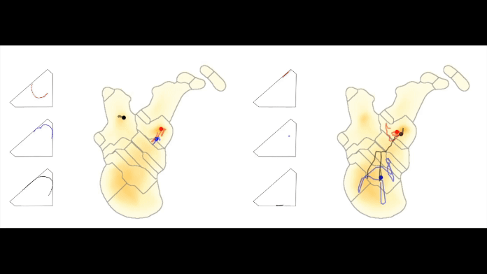

# fishcluster_toolbox
<p align="center">
    <figure>
    
    <figcaption>Low and high Entropy Individuals in physical and behavioural UMAP-Space (Supplementary Movie 5.1 in manuscript).</figcaption>
    </figure>
</p>

--- 

This repository provides a comprehensive set of tools for conducting behavioural analyses on timeseries of 2-D, x-y coordinate (i.e., movement) data. It includes unsupervised machine learning algorithms for embedding and inferencing using UMAP and K-Means. Unsupervised clustering is used to classify behaviors and calculate the degree of 'Shannon entropy' in behavioral space as a measure of behavioral diversity.


$\Rightarrow$ paper: [Ehlman SM, Scherer U, Bierbach D, Stärk L, Beese M, Wolf M. Developmental arcs of plasticity in whole movement repertoires of a clonal fish. bioRxiv. 2023:2023-12.](https://www.biorxiv.org/content/10.1101/2023.12.07.570540v1) \
$\Rightarrow$ link to dataset:

## Getting started using Docker
For easier software support across platforms and architectures, working with docker images and containers might be of help. 
For this a docker-deamon is required on the host machine.
### Pulling from Dockerhub
To pull the lastest cpu-image from dockerhub, please run the following command:
```bash
docker pull bmarv/fishcluster_toolbox:latest
```

### Modes and Dataset
This Docker Image supports multiple modes, that work in coherence with the later in greater detail described program-parts [preprocessing](#preprocessing), [training](#training) and [downstream](#downstream-analyses) analyses. All three modes can be activated as individual program-parts depending on the usecase. 

It is neccessary to also mount a dataset as a volume to the container for it to function.

Preprocessing the dataset to have the expected format for the training process requires the container to run with the following command:
```bash
docker run -e MODE=preprocessing -v /path/to/your/dataset/:/mnt/ bmarv/fishcluster_toolbox:latest
```
Analogous, running training can be done using:
```bash
docker run -e MODE=training -e WANDB_API_KEY=pasteHereYourWandBKey -v /path/to/your/dataset/:/mnt/ bmarv/fishcluster_toolbox:latest
```
Starting downstream analyses can be done using the following command:
```bash 
docker run -e MODE=downstream -v /path/to/your/dataset/:/mnt/ bmarv/fishcluster_toolbox:latest
```

Should different parameters be utilized, then these can be specified also using environment variables to the container. 

## Manual Installation
This codebase has been developed for unix-like systems and the x86 cpu-architecture using Python 3.9 \
To install the required dependencies, please use the conda package manager:
```bash
RUN conda env create --name fishcluster_toolbox --file environment.yml -y
```
After a successful installation, it is required to compile Cython-Code for your machine. For this, please use the [setup.py](./setup.py) file
```bash
python setup.py build_ext --inplace
```

## Configuration
Running the setup.py will create a `config.env` file inside the project. Please configure the path to your dataset:
```python
PROJ_PATH="/path/to/your/dataset"
```
Other variables regarding the used dataset and parameters for running the training can be set in the config.env file as well.

## Getting Started
### Data Preprocessing
The input data originates from experiments tracked with high-resolution camera systems and afterwards processed with computer vision models for object detection by the [Biotracker software](https://www.igb-berlin.de/en/biotracker) [[4]](#4-mönck-hauke-jürgen-et-al-biotracker-an-open-source-computer-vision-framework-for-visual-animal-tracking-arxiv-preprint-arxiv180307985-2018). \
Our workflow consists of preprocessing the data to do data-filtering and feature computations as well as to match our datastructure. \
For this, please specify additional required information in the `config.env` file. Environment variables that need to be specified are the following:
```python
N_BATCHES=15
N_BLOCKS=2
```
For running the preprocessing, please run the following python-module:
```bash
python -m processing.data_processing
```

This will give us a preprocessed dataset in the `./Projections/` directory of the overall dataset, where the data is stored as .mat files. \
The preprocessed dataset is published under [the following link] [[5]](#5-todo-insert-dataset-link)

### Training
For obtaining behavioural clusters, we rely on using unsupervised machine learning paradigms on the underlying dataset. Given the data, we perform embedding on the whole dataset using Uniform Manifold Approximation (UMAP) [[6]](#6-mcinnes-leland-john-healy-and-james-melville-umap-uniform-manifold-approximation-and-projection-for-dimension-reduction-arxiv-preprint-arxiv180203426-2018) and K-Means [[7]](#7-kanungo-tapas-et-al-an-efficient-k-means-clustering-algorithm-analysis-and-implementation-ieee-transactions-on-pattern-analysis-and-machine-intelligence-247-2002-881-892) as well as inferencing on all the individuals. Afterwards, using Watershed-Segmentation [[9]](#9-f-meyer-topographic-distance-and-watershed-lines-signal-processing-38-113125-1994) we can obtain behavioural clusters for further downstream analyses.

To run the training, please run the following command and specify the information:
```bash
python train.py --data  "/path/to/your/dataset" --n_neighbors xx --min_dist x.x --threads_cpu xx
```

After training, the embedding-models are stored in the `./Models/` directory of the dataset and the inferenced individuals alongside their original data in the `./Projections/` directory.

## Structure
### Dataset
#### Raw Data
The raw dataset after processing from Biotracker consists of multiple blocks with their respective front or back compartments. Every compartment includes footage from multiple cameras annotated by their camera-id for multiple days. Each day then has 15 batches of footage, where the timepoint and the corresponding x- and y-positions are stored. 

#### Published Dataset
Our published dataset is accessible under [the following link](#5-todo-insert-dataset-link) and includes already cleaned and preprocessed data. For every individual, indicated by _block-cameraid-compartment_, one file exists for every experimental-day in a .mat format. 
The included features for this timeseries are:
* X-Y Coordinates: The spatial positions of each fish are recorded over time, providing insights into their movement patterns within the experimental environment.
* Step-Length: Information on the distance covered by each fish per time step, offering a quantifiable measure of its activity.
* Turning-Angle: The angles at which the fish change direction from an initial heading (i.e. previous timestep), allowing for the analysis of navigation and path tortuosity.
* Distance-to-the-Wall: The proximity of each fish to the enclosure walls, providing context on habitat preferences and spatial utilization. 

Further information can be found at [insert link](!todo).

### Preprocessing
To ensure data quality and account for differential feature scaling, all data were normalized. We exclude days with missing trajectories from our analysis. Additionally, we only consider datapoints that are within the defined tank area. Datapoints that are identified as erroneous points are excluded, as was a given day's data for which less than 1000 datapoints per day were observed (most days have ~140k datapoints per individual), ensuring sufficient data for analysis.

For calculations of the features, we calculate the step size by measuring the Euclidean distance between two consecutive datapoints and converting it from pixels to centimeters. We use a window size of 2 datapoints.
The turning angle is calculated using the arctan function with the perpendicular and base lengths of a triangle formed by three consecutive x-y datapoints. 
The distance to the wall measures the Euclidean distance between a datapoint and the nearest wall, converted from pixels to centimeters. We use a window size of 1 datapoint.

### Embedding and Inferencing
In the training preprocessing stage, we perform normalization and apply a Morelet wavelet transform [[8]](#8-b-cazelles-et-al-wavelet-analysis-of-ecological-time-series-oecologia-156-287304-2008) to the data, with 25 distinct frequencies. Applied to timeseries of the original three features (step length, turning angle, and distance to the all), this results in timeseries of 75 features. Additionally, we use subsampling techniques. 

Embedding and Inferencing is done with both UMAP and K-Means.

For some of these processes, we utilize the [motionmapperpy](https://github.com/bermanlabemory/motionmapperpy) implementation based on the work by Berman et al. [[3]](#3-berman-gordon-j-et-al-mapping-the-stereotyped-behaviour-of-freely-moving-fruit-flies-journal-of-the-royal-society-interface-1199-2014-20140672).


### Segmentation
To obtain a specified number of clusters after training with UMAP we followed by Gaussian smoothing of data density in embedding space and a watershed transform [[9]](#9-f-meyer-topographic-distance-and-watershed-lines-signal-processing-38-113125-1994)
on the inverse of that density space. 

For some of these processes, we utilize the [motionmapperpy](https://github.com/bermanlabemory/motionmapperpy) implementation based on the work by Berman et al. [[3]](#3-berman-gordon-j-et-al-mapping-the-stereotyped-behaviour-of-freely-moving-fruit-flies-journal-of-the-royal-society-interface-1199-2014-20140672).

## Downstream Analyses
After training and obtaining the cluster-regions for both K-Means and UMAP, it is possible to compute the Coefficient of Variation (CoV) for the three original features and Entropy for the cluster-regions as a measure for changes in the plasticity or behavioral diversity of an individual. 
Obtaining the data and creating the tables for further analyses on the values for CoV and Entropy can be done by running the [downstream_analyses module](./downstream_analyses/) with the following command, for this to function, a Metadata-file has to be located at the directory of the original dataset:
```bash
python -m downstream_analyses
```

---
## References:
###### [1] Ehlman SM, Scherer U, Bierbach D, Stärk L, Beese M, Wolf M. Developmental arcs of plasticity in whole movement repertoires of a clonal fish. bioRxiv. 2023:2023-12.

###### [2] U. Scherer, S. M. Ehlman, D. Bierbach, J. Krause, M. Wolf, Reproductive individuality of clonal fish raised in near-identical environments and its link to early-life behavioral individuality. Nature Communications 14, 7652 (2023).

###### [3] Berman, Gordon J., et al. "Mapping the stereotyped behaviour of freely moving fruit flies." Journal of The Royal Society Interface 11.99 (2014): 20140672.

###### [4] Mönck, Hauke Jürgen, et al. "BioTracker: an open-source computer vision framework for visual animal tracking." arXiv preprint arXiv:1803.07985 (2018).

###### [5] !TODO! insert dataset link

###### [6] McInnes, Leland, John Healy, and James Melville. "Umap: Uniform manifold approximation and projection for dimension reduction." arXiv preprint arXiv:1802.03426 (2018).

###### [7] Kanungo, Tapas, et al. "An efficient k-means clustering algorithm: Analysis and implementation." IEEE transactions on pattern analysis and machine intelligence 24.7 (2002): 881-892.

###### [8] B. Cazelles, et al., Wavelet analysis of ecological time series. Oecologia 156, 287–304 (2008).

###### [9] F. Meyer, Topographic distance and watershed lines. Signal Processing 38, 113–125 (1994).
